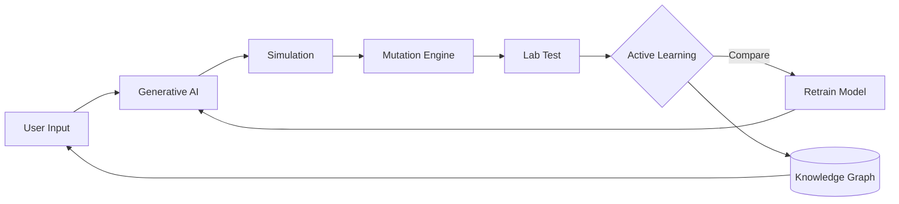

# MolAI-catalyst-synbio

> **AI-driven molecular design for chemical catalysis & synthetic biology**  
> *Generative models · Reaction simulation · Enzyme engineering · Active learning · Knowledge graphs*

[](https://opensource.org/licenses/MIT)
[](https://reactjs.org/)
[](https://www.typescriptlang.org/)
[](https://python.org/)

---

##  Overview

MolAI is an end‑to‑end AI platform that accelerates molecular discovery for **chemical catalysis** and **synthetic biology**. It combines five core pillars:

| Pillar | Function |
|--------|----------|
|  **Generative Catalyst Design** | Novel catalyst structures from target reactions (VAE/Diffusion) |
|  **Reaction Pathway Simulation** | ML‑accelerated energy profiling (1000× faster than DFT) |
|  **Enzyme Mutation Engine** | Mutation effect prediction (ΔΔG, kcat/Km) using AlphaFold + protein LLMs |
|  **Active Learning System** | Lab results → retrain models → continuous improvement |
|  **Collaborative Knowledge Graph** | Versioned, queryable graph connecting catalysts, reactions, outcomes |

---

##  Live Prototype Flowchart

The interactive flowchart below demonstrates the **closed‑loop workflow**:

```
[User Input] → [Generative Design] → [Simulation] → [Mutation] → [Lab Test] → [Active Learning] → [Retrain] → [Knowledge Graph] → (loop back)
```

##  Tech Stack – Languages & Frameworks

This repository uses a modern full‑stack architecture:

| Language / Tool | Usage | Files |
|----------------|-------|-------|
| **TypeScript (TS)** | Core frontend logic, type‑safe components, API clients | `*.ts`, `*.tsx` |
| **React (TSX)** | UI components, hooks, state management (Context + Redux) | `*.tsx` |
| **JavaScript (JS)** | Utility scripts, build configuration, interactive flowchart | `*.js` |
| **HTML5** | Page structure, canvas elements, SEO templates | `*.html` |
| **CSS3 / style.css** | Responsive styling, animations, dark/light themes | `*.css`, `*.scss` |
| **JSON** | Configuration files, mock data, model parameters, API schemas | `*.json` |

### Example file structure:

```
molai-platform/
├── frontend/
│   ├── src/
│   │   ├── components/
│   │   │   ├── Flowchart.tsx       # React + TSX interactive flowchart
│   │   │   ├── PredictionPanel.tsx
│   │   │   └── KnowledgeGraphView.tsx
│   │   ├── hooks/
│   │   │   └── useActiveLearning.ts
│   │   ├── styles/
│   │   │   └── style.css           # main styling
│   │   ├── App.tsx
│   │   └── index.html
│   ├── package.json                # dependencies & scripts
│   ├── tsconfig.json               # TypeScript configuration
│   └── public/
├── backend/
│   ├── models/
│   │   └── config.json             # model hyperparameters
│   ├── api/
│   └── main.py
└── README.md
```

---

##  Getting Started

### Prerequisites

- Node.js 18+ / npm or yarn
- Python 3.10+ (for backend ML models)

### Installation

```bash
# Clone the repository
git clone https://github.com/your-org/molai-platform.git
cd molai-platform

# Install frontend dependencies (React + TS)
cd frontend
npm install

# Start the development server
npm start
```

The app will open at `http://localhost:3000`

### Backend (optional, for ML inference)

```bash
cd backend
pip install -r requirements.txt
python app.py
```

---

##  Key Files by Language

### TypeScript (`.ts`) / TSX (`.tsx`)
- `src/components/Flowchart.tsx` – interactive flowchart with SVG arrows
- `src/services/api.ts` – typed API calls to ML endpoints
- `src/types/models.ts` – TypeScript interfaces for Catalyst, Enzyme, Reaction

### JavaScript (`.js`)
- `src/utils/activeLearningLoop.js` – client‑side simulation of retraining logic
- `webpack.config.js` – build configuration

### HTML (`.html`)
- `public/index.html` – base template with meta tags and root div

### CSS (`style.css` / `.css`)
- `src/styles/style.css` – glassmorphism, responsive grid, flowchart box styles
- `src/styles/darkTheme.css` – alternate theme

### JSON (`.json`)
- `package.json` – npm dependencies and scripts
- `tsconfig.json` – TypeScript compiler options
- `public/mockData/catalysts.json` – mock database of known catalysts
- `backend/model_config.json` – model hyperparameters

---

##  Prototype Workflow (JavaScript/TS Implementation)

```typescript
// Example: React hook for active learning
const useActiveLearning = (predictions: number[], actuals: number[]) => {
  const [discrepancy, setDiscrepancy] = useState<number[]>([]);
  
  useEffect(() => {
    const diff = predictions.map((pred, i) => Math.abs(pred - actuals[i]));
    setDiscrepancy(diff);
  }, [predictions, actuals]);
  
  return { discrepancy, retrainTrigger: discrepancy.some(d => d > 0.2) };
};
```

```javascript
// Example: Generative design simulation (JavaScript)
function generateCatalyst(targetReaction) {
    // Mock VAE inference
    const candidates = [
        { smiles: "CCO", tof: 124.5 },
        { smiles: "CC(=O)O", tof: 89.3 }
    ];
    return candidates.sort((a,b) => b.tof - a.tof);
}
```

---

##  Interactive Flowchart (React + TSX)

The main flowchart is built with **React functional components** and **TypeScript**:

```tsx
// Flowchart.tsx excerpt
const Flowchart: React.FC = () => {
  const nodes = [
    { id: 'input', title: 'User Input', icon: 'fa-vial', pillar: 'start' },
    { id: 'gen', title: 'Generative Design', icon: 'fa-atom', pillar: 'pillar1' },
    // ...
  ];
  
  return (
    <div className="flowchart-grid">
      {nodes.map(node => (
        <FlowBox key={node.id} node={node} />
      ))}
    </div>
  );
};
```

---

##  Active Learning Loop – Visualized



---

##  Contributing

We welcome contributions in any of the core languages:

- **TypeScript/TSX** – new UI components or hooks
- **CSS** – theming or responsive improvements
- **JavaScript** – utility scripts or demo enhancements
- **JSON** – adding sample data or configuration

Please see [CONTRIBUTING.md](CONTRIBUTING.md) for guidelines.

---

##  License

MIT © 2026 MolAI Team

---

##  Contact

- **Email:** discovery@molai.bio  
- **GitHub Issues:** [Report bug or request feature](https://github.com/your-org/molai-platform/issues)  
- **Demo:** [https://molai-demo.vercel.app](https://molai-demo.vercel.app)
